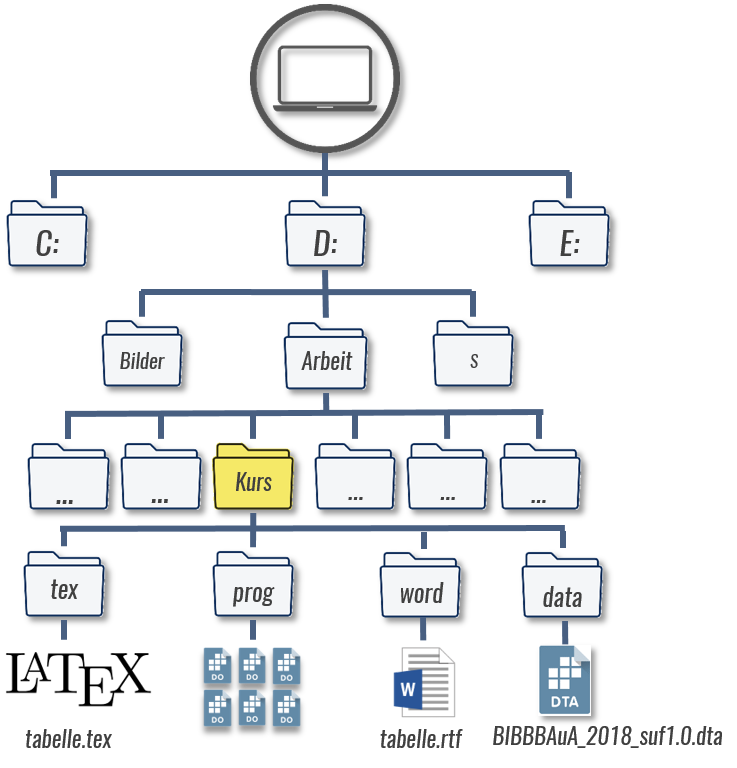

# Tabellenexport mit Stata: Grundlagen & Pakete {#base} 

```{r setup1, echo = F, message=F, warning = F}
.libPaths("D:/R-library4")
knitr::opts_chunk$set(collapse = TRUE)
knitr::opts_chunk$set(dpi=800)
# knitr::opts_chunk$set(collectcode = T)
library(Statamarkdown)
library(tidyverse)
library(kableExtra)
# stataexe <- "C:/Program Files (x86)/Stata13/StataSE-64.exe"
stataexe <- "C:/Program Files/Stata16/StataSE-64.exe"
knitr::opts_chunk$set(engine.path=list(stata=stataexe))
# baua <- readstata13::read.dta13("D:/Datenspeicher/BIBB_BAuA/BIBBBAuA_2018_suf1.0.dta",convert.factors = F)
```

```{r, include = F}
# knitr::include_graphics()
```


Es gibt eine ganze Reihe von `ado`s, welche einen Tabellenexport aus Stata erlauben.
Wir werden mit [`estout`/`esttab`](http://repec.sowi.unibe.ch/stata/estout/) von Ben Jann arbeiten, das einige Vorteile bietet:
Zunächst können damit sowohl Deskriptions- als auch Regressionstabellen exportiert werden - man muss also nur eine Syntaxlogik lernen.
Dabei sind Exportbefehle für (fast) alle gängigen Deskriptionen und Regressionsmodelle vorhanden, inklusive Outputs von `margins`.
Außerdem können damit Tabellen sowohl in Word-, Latex- und auch Excel-Formate exportiert werden - auch hier ist (fast) die gleiche Syntaxlogik verwendbar.
Darüber hinaus bietet `esttab` die Möglichkeit einiger Formatierungseinstellungen.

Um `estout`/`esttab` zu verwenden, müssen wir es zunächst installieren:
```{stata instesttab, eval=F}
ssc install estout, replace
```
Dies sind die aktuellen Versionen:
```{stata checkestout}
which estout // check versions
```

```{stata checkesttab}
which esttab // check version
```

Mit `estout`/`esttab` können wir Tabellen mit zusammenfassenden Statistiken und Regressionsergebnissen zu erstellen, die leicht in \LaTeX oder importiert werden können oder in Word verwendet werden können.
Für die Latex-Verion ergibt sich der Vorteil, dass das ganze System dynamisch ist. 
Wenn wir etwas in unserem Do-File ändern (z. B. eine bestimmte Gruppe weglassen, eine neue Variabe aufnehmen), dann werden die Ergebnisse automatisch in LaTeX aktualisiert. 
Das kann eine Menge Zeit sparen, aber die Einrichtung in Latex ist sehr zeitintensiv und deren Details würden den Rahmen unseres Kurses sprengen.
Ich stelle daher [hier](https://www.overleaf.com/read/cfjbtghnxrcn) eine (sehr einfache) Latexvorlage zur Verfügung, die versierte Latex-Nutzer*innen gerne an Ihre Bedürfnisse anpassen können.
<!-- https://www.overleaf.com/read/zgnvgxdzzptg -->

## Grundlagen: `e()` und `r()`

Grundsätzlich baut `esttab` auf die Postestimates `e()` auf.
Bei jedem Befehl werden im Hintergrund Werte in Matrizen und Skalere (also Zahlen) abgelegt, bspw. bei einem Regressionsmodell. Mit `ereturn list` können wir uns eine Liste der Postestimates ausgeben lassen:
```{stata regF, eval = F}
quietly reg F518_SUF zpalter
ereturn list
```

```{stata regT, echo = F}
qui use "D:\Datenspeicher\BIBB_BAuA/BIBBBAuA_2018_suf1.0_clean.dta", clear
qui reg F518_SUF zpalter
ereturn list
```

Das Grundprinzip ist dann immer:

(@) Auswertungsbefehl
(@) Tabelle mit `esttab` erstellen


Die Matrizen können wir mit `matrix list`, die `Skalare` mit `scalar list` + Name aufrufen, unter `e(b)` sind beispielsweise die Koeffizienten abgelegt:
```{stata reg2F, eval = F}
matrix list e(b)
```

```{stata reg2T, echo = F}
qui use "D:\Datenspeicher\BIBB_BAuA/BIBBBAuA_2018_suf1.0_clean.dta", clear
qui reg F518_SUF zpalter
matrix list e(b)
```

Bei vielen deskriptiven Befehlen werden die Kennzahlen hingegen als *results* in `r()` abgelegt. 
An die Werte in `r()` kommen wird mit `return list`, `ereturn list` für `e()` ist dahingegen leer:
```{stata su1F, eval = F}
quietly su F518_SUF
ereturn list
return list
```

```{stata su1T, echo = F}
qui use "D:\Datenspeicher\BIBB_BAuA/BIBBBAuA_2018_suf1.0_clean.dta", clear
quietly su F518_SUF
ereturn list
return list
```

Das bringt mit sich, dass wir für Deskriptionen meist mit dem Hilfsbefehl `estpost` die in `r()` abgelegten Ergebnisse in `e()` umwandeln müssen.
Grundsätzlich sind aber die Ergebnisse aus `e()` und `r()` alle in Tabellen mit `esttab` exportierbar.


## Kurs-Setup

```{r index_illustration01, echo = F,out.width = "80%",fig.height= 3, fig.align="center"}

```

## Übung

+ Generieren Sie einmal `BIBBBAuA_2018_suf1.0_clean.dta` mit Hilfe von `00_init.do` für die weiteren Aufgaben.
+ Testen Sie einmal `return list` und `erturn list` nach `reg F518_SUF zpalter` bzw.  `su zpalter`

